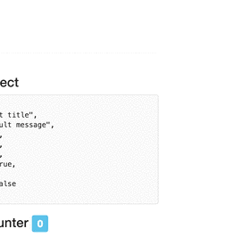

# React Notification System

A complete and totally customizable notification system for React applications.



## Demo

* [http://igorprado.github.io/react-notification-system](http://igorprado.github.io/react-notification-system)

## Installing

For now this component is only available as CommonJS module. Install via NPM running:

```
npm install react-notification-system
```

## Using

For optimal appearance, this component **must be rendered on a top level HTML element** in your application to avoid position conflicts.

Here is a basic example. For a more advanced usage, please see the [example code](https://github.com/igorprado/react-notification-system/blob/master/example/src/app.js).

```js
var React = require('react');
var NotificationSystem = require('react-notification-system');

var MyComponent = React.createClass({
  _notificationSystem: null,

  _addNotification: function(event) {
    event.preventDefault();
    this._notificationSystem.addNotification({
      message: 'Notification message',
      level: 'success'
    });
  },

  componentDidMount: function() {
    this._notificationSystem = this.refs.notificationSystem;
  },

  render: function() {
    return (
      <div>
        <button onClick={this._addNotification}>Add notification</button>
        <NotificationSystem ref="notificationSystem" />
      </div>
      );
  }
});

React.render(
  React.createElement(NotificationSystemExample),
  document.getElementById('app')
);
```

## Creating a notification

The notification object has the following properties:

| Name         | Type            | Default   | Description                                                                                                                                                               |
|------------  |---------------  |---------  |-------------------------------------------------------------------------------------------------------------------------------------------------------------------------  |
| title        | string          | null      | Title of the notification                                                                                                                                                 |
| message      | string          | null      | Message of the notification                                                                                                                                              |
| level        | string          | null      | Level of the notification. Available: **success**, **error**, **warning** and **info**                                                                                    |
| position     | string          | tr        | Position of the notification. Available: **tr (top right)**, **tl (top left)**, **tc (top center)**, **br (bottom right)**, **bl (bottom left)**, **bc (bottom center)**  |
| autoDismiss  | integer         | 5         | Delay in seconds for the notification go away. Set this to **0** to not auto-dismiss the notificaion                                                                      |
| dismissible  | bool            | true      | Set if notification is dismissible by the user. [See more](#dismissible)                                                                                                  |
| action       | object          | null      | Add a button with label and callback function. [See more](#action)                                                                                                        |

### Dismissible

If set to false, the user will not be able to dismiss the notification. For this reason, if set to false, the `action` becomes required as the only way to dismiss the notification.

### Action

Add a button and a callback function to the notification. If this button is clicked, the callback function is called and the notification is dismissed.

```js
notification = {
  [...],
  action: {
    label: 'Button name',
    callback: function() {
      console.log('Notification button clicked!');
    }
  }
}

```

## Styles

This component was made to work as plug and play. For that, a handcrafted style was added to it and is used as inline CSS.

You can change this style by overriding the default inline styles or disable all inline styles and use your own styles.

### Overriding

For this, use the `style` prop to pass an object with your styles. Your object must be something like this:

```js
var style = {
  NotificationItem: { // Override the notification item
    DefaultStyle: { // Applied to every notification, regardless of the notification level
      margin: '10px 5px 2px 1px'
    },

    success: { // Applied only to the success notification item
      color: 'red'
    }
  }
}

<NotificationSystem ref="notificationSystem" style={style} />

```

Refer to [this file](https://github.com/igorprado/react-notification-system/blob/develop/dist/styles.js) to see what can you override.

### Disabling inline styles

To disable all inline styles, just pass `false` to the prop `style`.

```js
<NotificationSystem ref="notificationSystem" style={false} />
```

Here is the notification HTML:

```html
<div class="notifications-wrapper">
  <div class="notifications-{position}"> <!-- '{position}' can be one of the positions available: ex: notifications-tr -->
    <div class="notification notification-{level} notification-{state} {notification-not-dismissible}"> <!-- '{level}' can be: success | error | warning | info. '{state}' can be: visible | hidden. {notification-not-dismissible} is present if notification is not dismissible by user -->
      <h4 class="notification-title">Default title</h4>
      <div class="notification-message">Default message</div>
      <span class="notification-dismiss">×</span>
      <div class="notification-action-wrapper">
        <button class="notification-action-button">Action button</button>
      </div>
    </div>
  </div>
</div>

```

#### Important

Using this method you have to take care of **every style**, since containers positions and the animations. To control animations, use the classes `notification-visible` and `notification-hidden`. If your CSS styles will not handle any animation (transition), you need to set the prop `noAnimation` to `true` when adding the Notification System component:

```js
<NotificationSystem ref="notificationSystem" noAnimation={true} />
```
## Roadmap

* Add tests
* Improve performance

## Contributions

Clone this repo by running:

```
git clone git@github.com:igorprado/react-notification-system.git
```

Enter the project folder and install the dependencies:

```
npm install
```

To build the files, run from `root` folder:

```
npm run build
```

To watch files for change and automatically build:

```
npm run watch
```

This component is under construction. I will add more guidelines to who wants to contribute.
